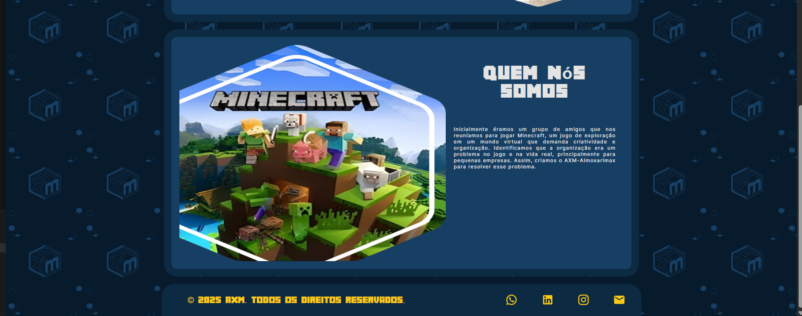
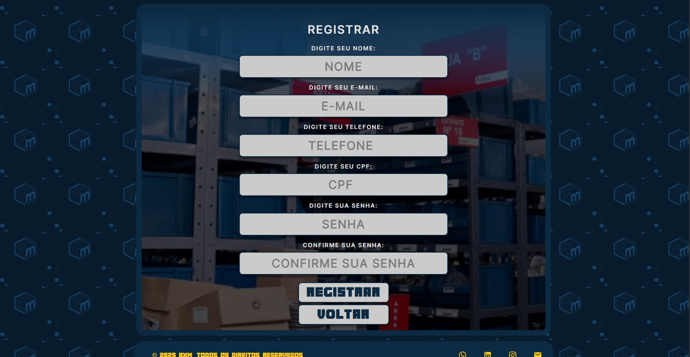
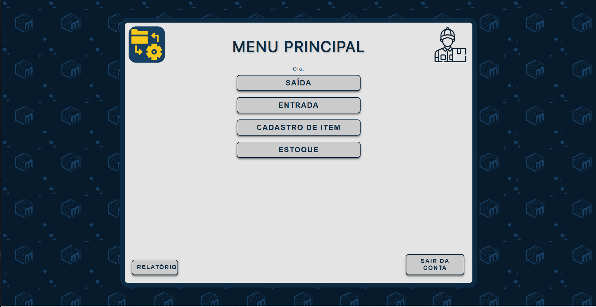
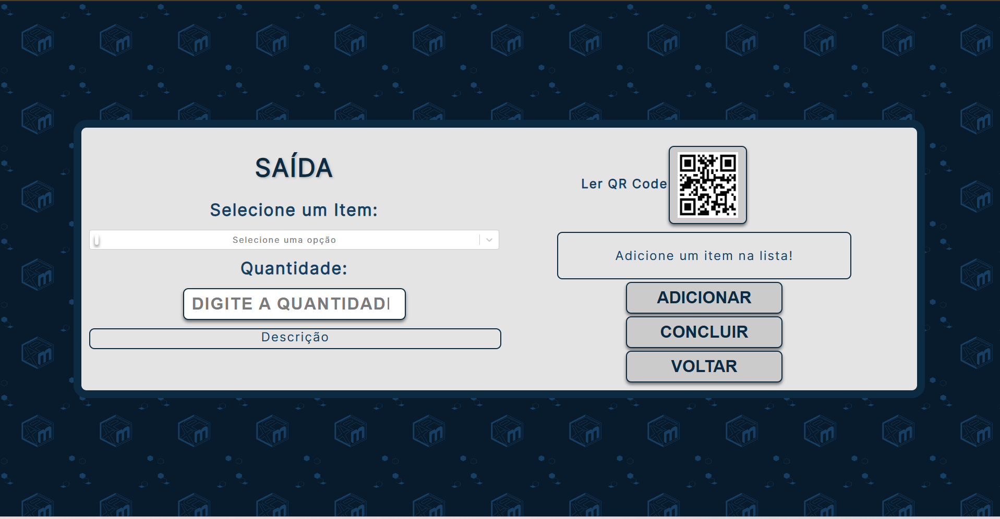
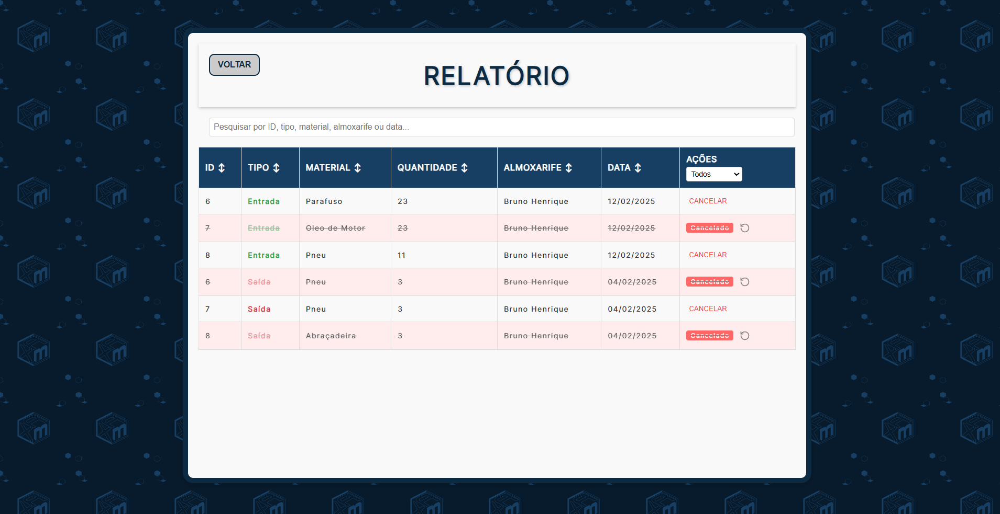
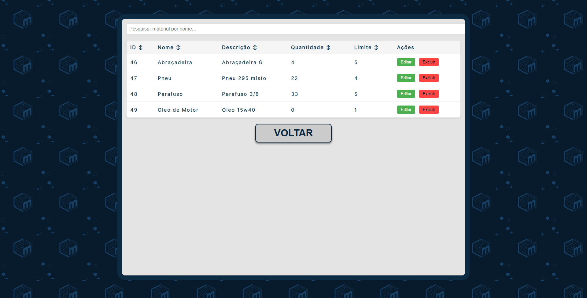

# controle_almoxarifado_estoque
Projeto desenvolvido como Trabalho de Conclusão de Curso (TCC) do curso técnico em Desenvolvimento Web. A aplicação web foi criada com o objetivo de auxiliar no controle de estoque de materiais, oferecendo uma solução simples, prática e acessível por meio do navegador.  

Imagens das partes mais importantes do projeto:

Pagina inicial:

Cadastro de usuario:

Pagina ao fazer login:

Saida de material e QR CODE:

Relatorio e materiais em estoque:

